<div align="center">

# MixStyleGAN

### *Two painters. One canvas. A duck.*

**A dual-conditioning diffusion pipeline that puts two artistic styles on the same image — with weight sliders, paintable region masks, and color-preserving structure transfer.**

</div>

---

## Meet the cast

### Sir Quack — gentleman, monocle, perpetually nineteen-twenties

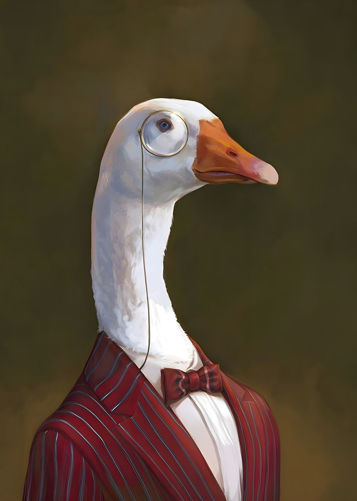

This is **Sir Quack** — every artist's model for the duration of this project.

He arrived as a single high-resolution digital portrait — a goose in a red pinstripe suit, monocle wire trailing down his neck, coral bowtie, pristine white shirt — and he has graciously held still while the algorithm tried to render him in the visual language of a dozen art movements.

He never complains. He never blinks. He wears the monocle in *every* style, even the ones that aren't supposed to allow monocles. The bowtie occasionally goes missing in Picasso's Blue Period — a known artifact of the model's color-region contention, not Sir Quack's choice.

He is, for the purposes of this README, your subject.

<br clear="all">

---

## The question that started it all

What happens if **Vincent van Gogh** paints the sky and **Pablo Picasso** paints the man standing in front of it?

That was the founding question of this project. Not "transfer Van Gogh's style to a photo" — that's a solved problem. The interesting question was: *can two painters work on the same canvas at the same time, each handling a different region, without their styles muddying into a beige sludge in the middle?*

The two reference paintings — chosen because they're **formal opposites**:

|  Van Gogh  |  Picasso  |
|:---:|:---:|
| 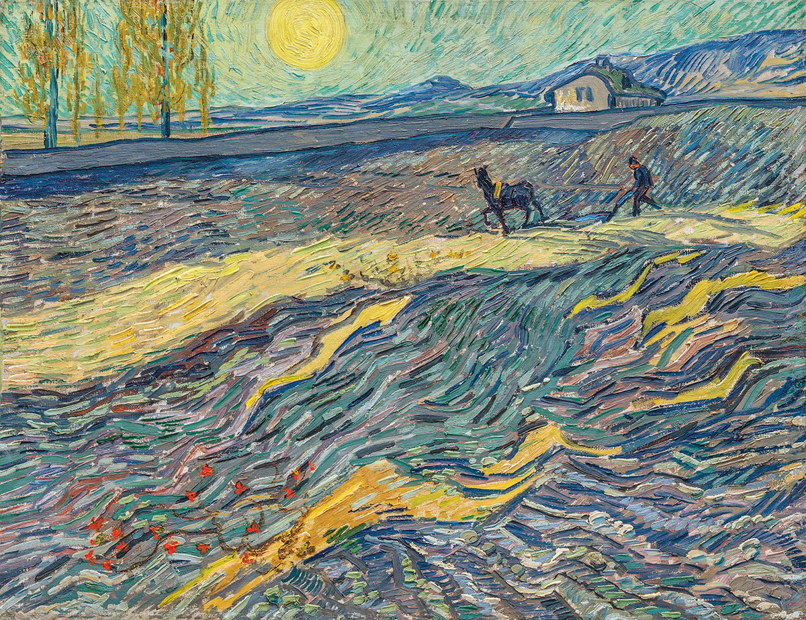 | 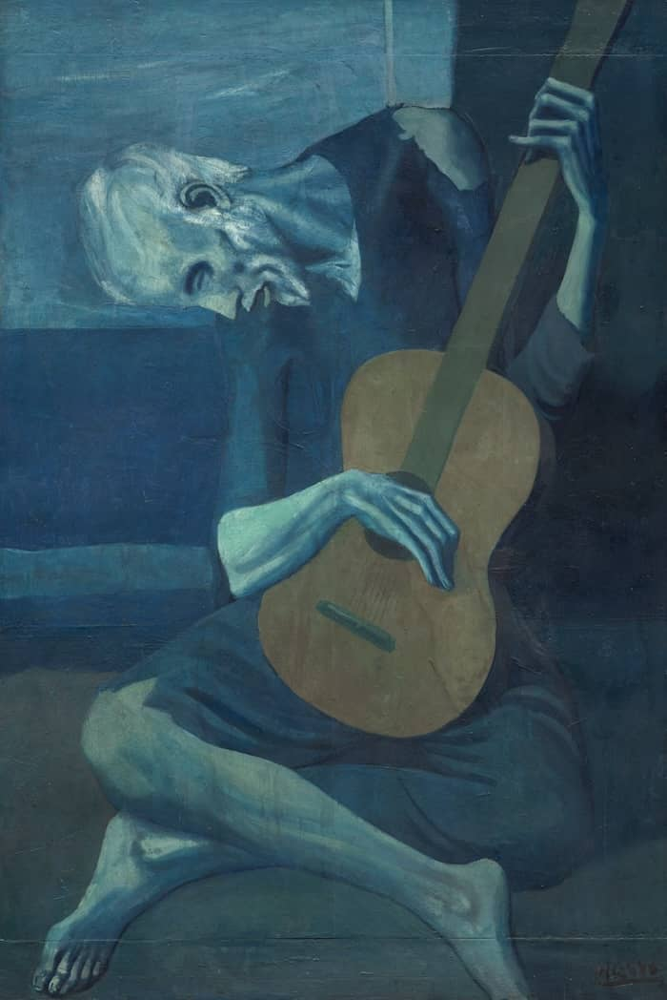 |
| Late period. Turbulent skies, thick directional brushwork, intense color. **Additive** — every surface gets paint stacked on top. | Blue Period. Flat planes of color, heavy contour lines, melancholy palette. **Reductive** — every surface gets simplified to essential geometry. |

Mixing these isn't blending — it's reconciling two incompatible philosophies of paint.

### The fusion

|  Picasso on the duck • Van Gogh on the sky  |  Van Gogh on the duck • Picasso on the sky  |
|:---:|:---:|
| 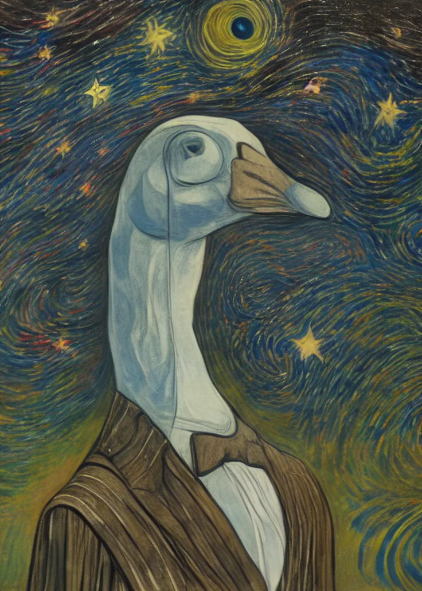 | 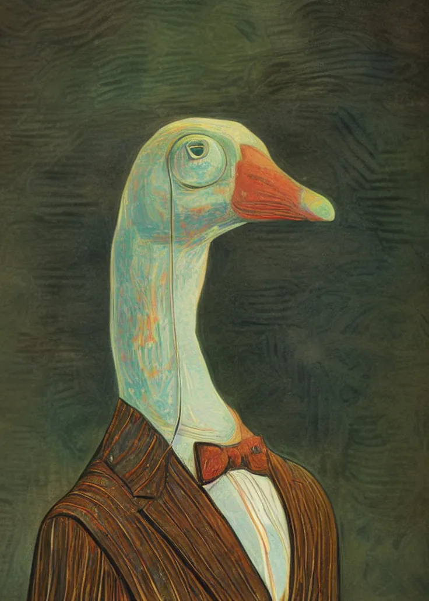 |
| The duck is still in a turbulent universe. | The duck is alive in a calmer void. |

Same algorithm. Same input. Mask inverted. The boundary between the two styles is **clean** — no Van Gogh brushwork leaking onto the duck, no Picasso flatness invading the sky. That clean boundary is the whole point of the architecture.

---

## Eight movements, one duck

To prove this isn't a Van Gogh / Picasso parlor trick, **Sir Quack** has been rendered in eight art movements spanning two centuries. Each is the *full* application of that style — no mask, no mixing — to demonstrate that the pipeline understands artistic *vocabulary*, not just palette.

<table>
  <tr>
    <td align="center">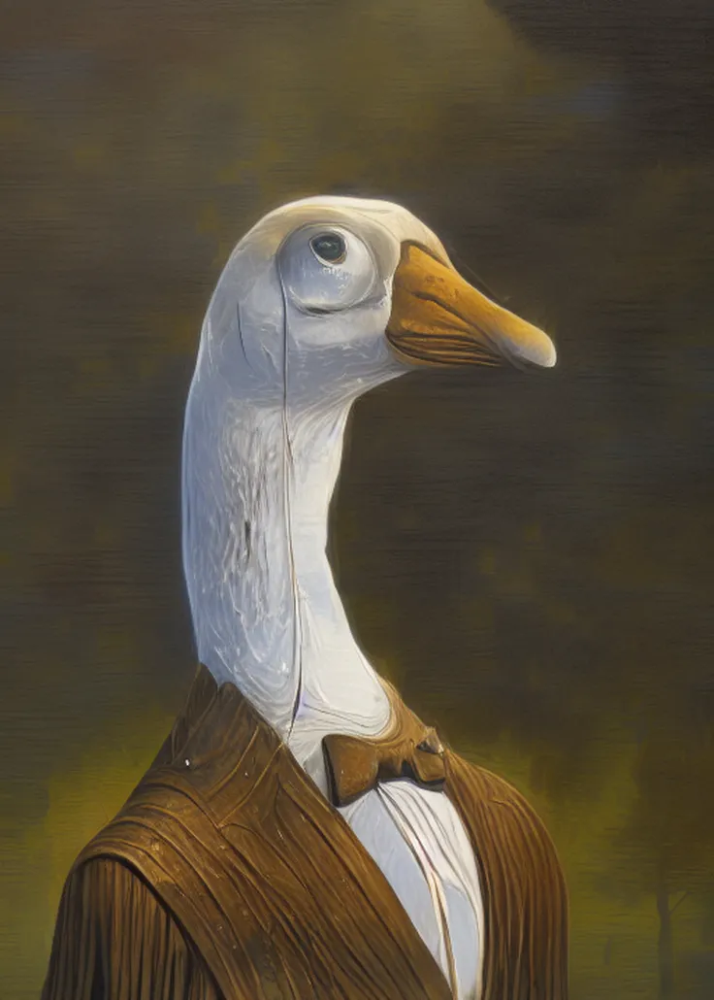<br><b>Realism</b><br><sub>Faithful surfaces, restrained palette</sub></td>
    <td align="center">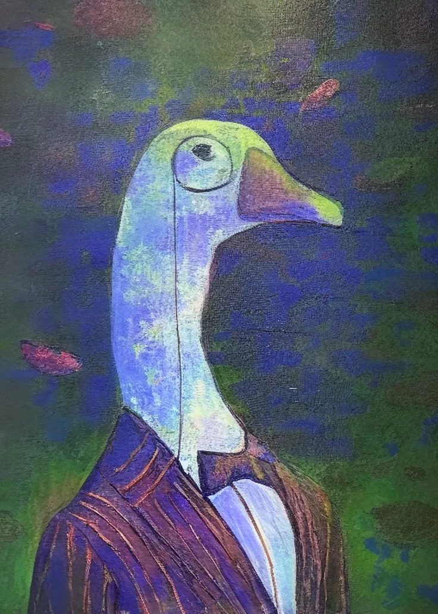<br><b>Impressionism</b><br><sub>Light over form, broken color</sub></td>
    <td align="center">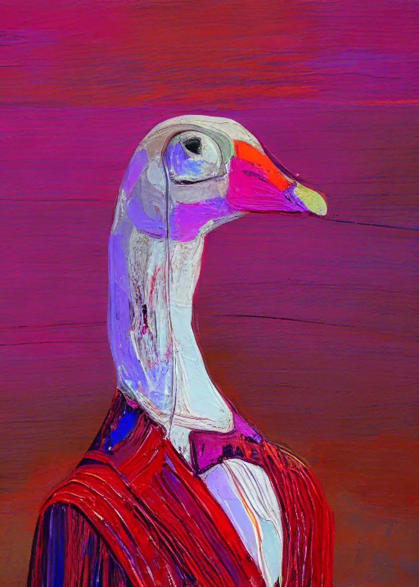<br><b>Expressionism</b><br><sub>Emotional over accurate</sub></td>
    <td align="center">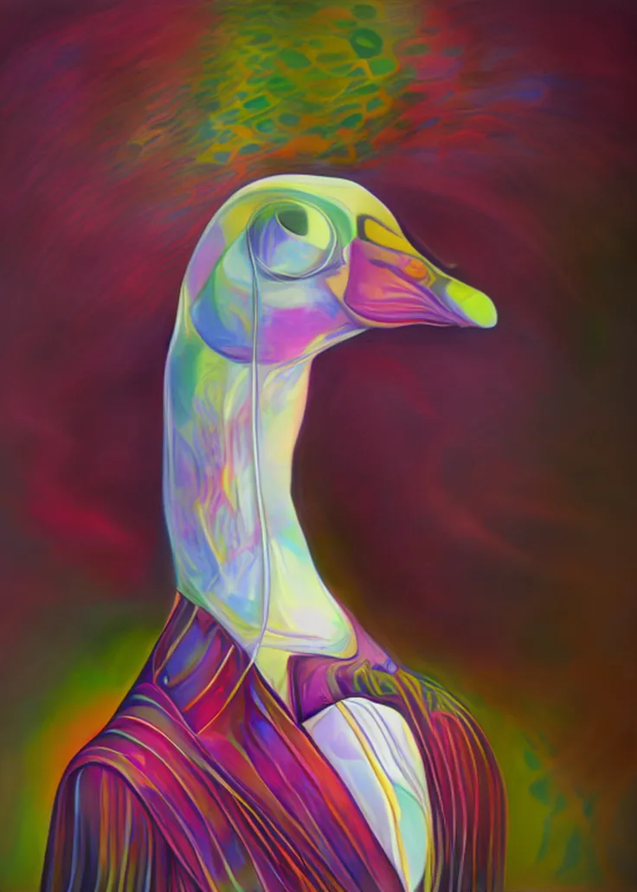<br><b>Futurism</b><br><sub>Motion, energy, prismatic chaos</sub></td>
  </tr>
  <tr>
    <td align="center">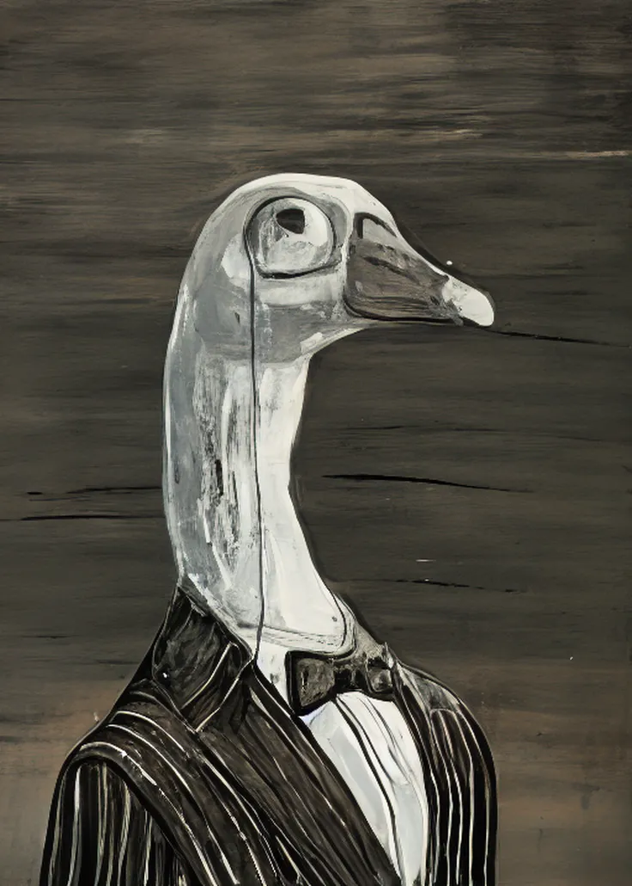<br><b>Surrealism</b><br><sub>Iridescent dream-logic</sub></td>
    <td align="center">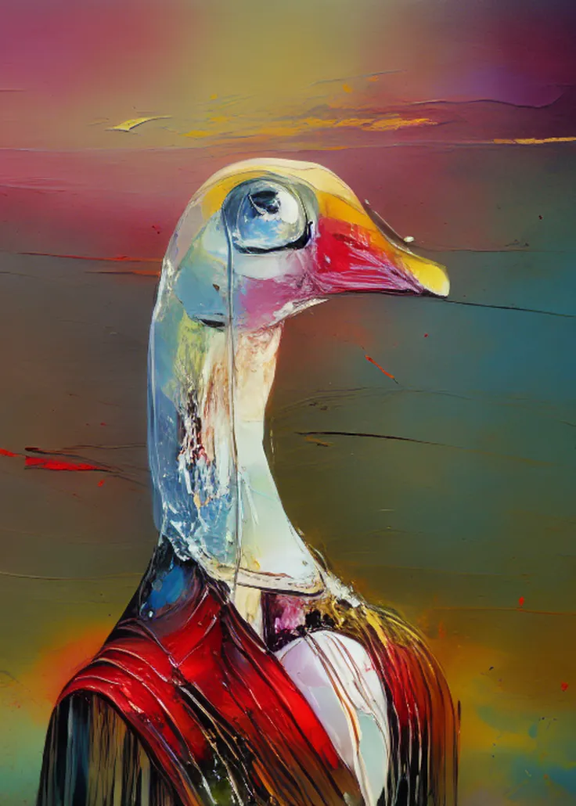<br><b>Abstract</b><br><sub>Subject as pretext, paint as subject</sub></td>
    <td align="center">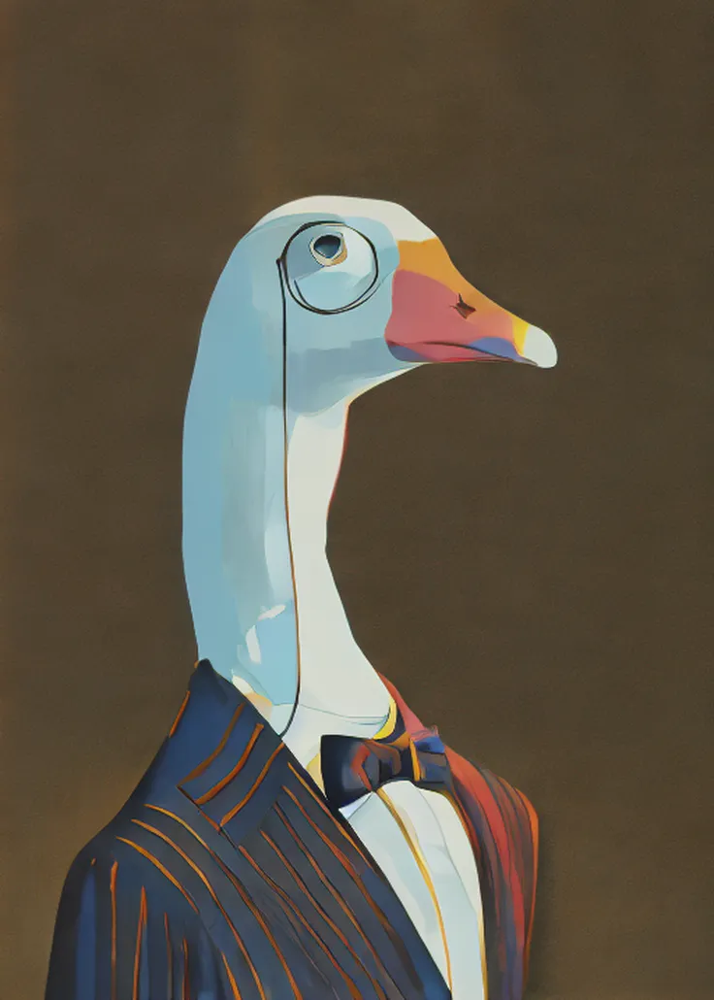<br><b>Pop Art</b><br><sub>Flat planes, hard outlines, bold color</sub></td>
    <td align="center">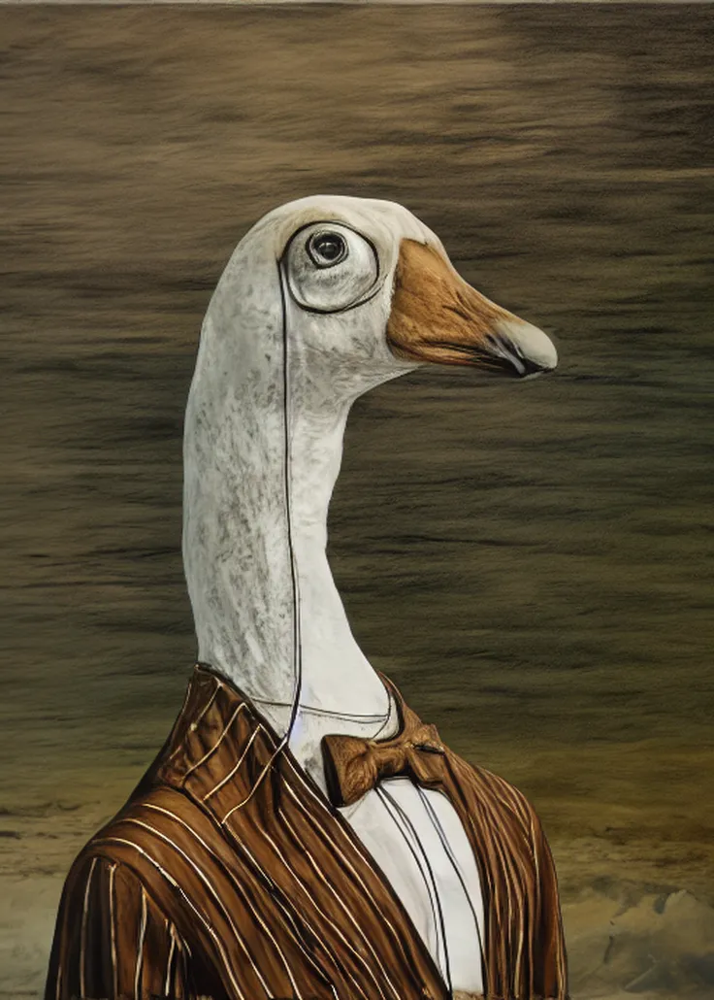<br><b>Photo-realism</b><br><sub>Painted with the precision of a lens</sub></td>
  </tr>
</table>

What's striking across the set: **Sir Quack remains Sir Quack** in every rendering. Pop Art's hard outlines, Futurism's chaotic motion-whorls, Surrealism's iridescent dream-glow — none of them dissolve the subject. The monocle survives Cubism. The bowtie shows up in seven of eight. That's the structure-preservation half of the pipeline doing its job.

> **Coming next: the 8 × 8 fusion matrix.** Every movement applied to the foreground while every other movement claims the background. Sixty-four cells of style fusion as a controlled experiment in computational art history. Watch this space.

---

## How it actually works

Most "style transfer" tools are a single black box: input image, style image, output image. This pipeline is **four cooperating components**, each doing one job.

```
                  ┌──────────────────────────────────────┐
                  │           Sir Quack (input)          │
                  └─────────┬────────────────────┬───────┘
                            │                    │
                            ▼                    ▼
                  ┌──────────────────┐  ┌─────────────────┐
                  │   Canny edges    │  │  Raw RGB image  │
                  │  (the bones)     │  │  (the colors)   │
                  └────────┬─────────┘  └────────┬────────┘
                           │                     │
                           ▼                     ▼
                  ╔═══════════════════╗ ╔════════════════════╗
                  ║ ControlNet-Canny  ║ ║ ControlNet-Tile    ║
                  ║                   ║ ║                    ║
                  ║ Locks composition ║ ║ Pulls original     ║
                  ║ — keeps the duck  ║ ║ palette through —  ║
                  ║ a duck.           ║ ║ keeps the bowtie   ║
                  ║                   ║ ║ coral.             ║
                  ╚═════════╤═════════╝ ╚═════════╤══════════╝
                            │                     │
                            └──────────┬──────────┘
                                       │
                                       ▼
                  ╔═════════════════════════════════════════╗
                  ║       Stable Diffusion 1.5 UNet         ║
                  ║   (the actual painting happens here)    ║
                  ╚════════════════════╤════════════════════╝
                                       │
                  ┌────────────────────┼────────────────────┐
                  │                    │                    │
            cross-attention      cross-attention      cross-attention
                  │                    │                    │
                  ▼                    ▼                    ▼
            ┌──────────┐         ┌──────────┐        ┌─────────────┐
            │ Style A  │         │ Style B  │        │    Mask     │
            │IP-Adapter│         │IP-Adapter│        │ (which is   │
            │(painter 1)│        │(painter 2)│       │ which where)│
            └──────────┘         └──────────┘        └─────────────┘
```

### The four roles

| Component | What it does | Knob you control |
|---|---|---|
| **Stable Diffusion 1.5** | The canvas — pretrained image generator producing the actual pixels. | (model itself) |
| **ControlNet-Canny** | Reads the input's edges and feeds them in as a "draw inside these lines" instruction during every denoising step. Keeps the duck a duck. | Structure scale |
| **ControlNet-Tile** | Reads the input's raw colors at low frequency. Keeps the bowtie coral, the suit red, the feathers white. | Color preservation |
| **2× IP-Adapter** | Two independent style conditioners. Each takes one painting as input, projects it into the diffusion model's cross-attention space, and contributes its style features to the generation. | Style A weight, Style B weight |

### Foreground vs background — the actual mechanism

The painting comes out with two styles in two regions because of one specific thing: **`cross_attention_kwargs["ip_adapter_masks"]`**.

Here's what's happening, mechanically. During each of the ~30 denoising steps, the UNet runs cross-attention between the noisy image latent and *each* IP-Adapter's image embeddings. Without masks, both style adapters' contributions get added to every pixel of the latent — that's "global mixing." With masks, each adapter's attention output is multiplied element-wise by its mask before being added.

```python
# Simplified — the actual diffusers code is more elaborate
attention_A = cross_attention(latent, style_A_embeddings)  # full image
attention_B = cross_attention(latent, style_B_embeddings)
masked_A = attention_A * mask_A    # mask_A: 1 inside painted region, 0 outside
masked_B = attention_B * mask_B    # mask_B = 1 - mask_A
final = base_attention + weight_A * masked_A + weight_B * masked_B
```

Each style's "vote" only counts where its mask is 1. The two votes never overlap — they're spatially partitioned.

**This is why the boundary is clean.** There's nothing happening *at* the boundary; one side's contribution simply ends and the other side's begins. No averaging across the seam, no blended pixels, no muddy beige.

You paint where you want Style A. The complement automatically becomes Style B. The math handles the rest.

### Why the simpler approaches fail

| Approach | What goes wrong |
|---|---|
| Train a CycleGAN per style, average outputs in pixel space | Pixel averaging is a low-pass filter — you get muddy ghosts, not a fusion. *(See [`MixStyleGAN.py`](MixStyleGAN.py) — the legacy scaffold this project is named after.)* |
| Train two LoRAs and merge weights | Both LoRAs touch the same attention layers and *fight* there. Output collapses or interferes. |
| Use IP-Adapter Plus (high-fidelity variant) | Plus encodes a *grid* of CLIP features, including object-level information. Putting two paintings through it bleeds *content* — Picasso's guitar literally appears in the scene. |
| **IP-Adapter base + per-region attention masks** *(this project)* | Base encodes a single pooled CLIP embedding — *style only, no objects*. Masks confine each style to its region. **No interference. No content bleed. Clean boundaries.** |

---

## What you actually control

Six sliders. They compose like a paint chemist's mixing board.

| Slider | Range | What it does |
|---|:---:|---|
| **Style A weight** | 0.0 – 1.5 | How loud Style A is in its region. 0 = invisible. 0.7 = balanced. 1.2 = aggressive. |
| **Style B weight** | 0.0 – 1.5 | Same, for Style B. |
| **Color preservation (Tile)** | 0.0 – 1.0 | How much of the input's original palette persists. 0 = full style takeover. 0.4 = sweet spot — bowtie stays coral, but the rest goes painterly. 0.8+ = mostly the original colors with stylization on top. |
| **Structure (Canny scale)** | 0.0 – 1.5 | How rigidly the result follows the input's edges. 1.0 = strict. 0.5 = looser, more painterly. |
| **Canny low/high thresholds** | 0 – 255 | Edge-detection sensitivity. Tune for soft-gradient inputs vs sharp portraits. Live preview in the UI. |
| **Guidance scale** | 1 – 12 | How aggressively the model commits to the conditioning. 7 = standard. 5 = looser. 9+ = oversaturated. |

Three modes emerge from these knobs:

1. **Different styles, same weight, no mask** → cross-style global blend.
2. **Same style image, different per-region weights** → painterly emphasis (subject readable, background dramatic).
3. **Different styles, spatial mask** → one painter per region. The flagship mode.

---

## Quickstart

### Run on Colab (free, easiest)

1. Open [`MixStyleGAN_Colab.ipynb`](MixStyleGAN_Colab.ipynb) in Google Colab.
2. `Runtime > Change runtime type > T4 GPU`.
3. `Runtime > Run all`. The last cell prints a `gradio.live` URL.
4. Upload Sir Quack (or your own subject) + two style references → drag sliders → Generate.

### Deploy as a Hugging Face Space

The frontmatter at the top of this file is HF Space configuration. Push the repo to a Space and it self-deploys:

```bash
huggingface-cli login
huggingface-cli repo create mixstylegan --type=space --space_sdk=gradio
git remote add space https://huggingface.co/spaces/<your-username>/mixstylegan
git push space main
```

Free CPU tier serves as code reference only (3–5 min/image). For a usable demo, enable ZeroGPU (HF Pro, $9/mo) or a paid T4 Space ($0.40/hr while active).

### Run locally

Requires NVIDIA GPU with ~6 GB VRAM minimum.

```bash
git clone https://github.com/<your-username>/MixStyleGAN.git
cd MixStyleGAN
pip install -r requirements.txt
python app.py
```

---

## Repository

```
.
├── app.py                            # Gradio entry point (HF Spaces / local)
├── mixstylegan_pipeline.py           # Pipeline + helpers
├── MixStyleGAN_Colab.ipynb           # Self-contained Colab notebook
├── examples/
│   ├── styles/                       # Style reference paintings
│   │   ├── vangogh.png                  Van Gogh — motivation pair
│   │   ├── picasso.png                  Picasso — motivation pair
│   │   ├── abstract_art.png             Eight movements ↓
│   │   ├── expressionism.png
│   │   ├── futurism.png
│   │   ├── impressionism.png
│   │   ├── photorealism.png
│   │   ├── pop_art.png
│   │   ├── realism.png
│   │   ├── surrealism.png
│   │   └── symbolism.png                (ninth, render pending)
│   └── results/
│       ├── subject_sir_quack.png        The original subject
│       ├── FULL_*.png                   Single-style takeovers
│       ├── picasso_on_vangogh.png       Cross-style spatial mix
│       ├── vangogh_on_picasso.png       Inverse spatial mix
│       └── early/                       First-run experiments
├── MixStyleGAN.py                    # Legacy CycleGAN scaffold (named-for, kept as research baseline)
├── requirements.txt
├── LICENSE                           # MIT
└── README.md                         # This file (also the HF Space README)
```

---

## Why this project, and what it contributes

Computational art history has a tooling gap. The two ends of the spectrum are well-served:

- **Style transfer of one image to one style** — trivially easy. AdaIN, neural style transfer, Stable Diffusion + LoRA, IP-Adapter alone. Pick your decade.
- **Generating new images from text in a style** — trivially easy. Any modern diffusion model with a stylized LoRA does this.

The middle ground — *putting two specific styles in conversation, on the same canvas, in regions of the user's choosing* — is conspicuously underbuilt. The few tools that try (regional prompter extensions, ControlNet-Reference + IP-Adapter combinations) require Photoshop-level fluency with twenty different sliders to produce one decent image.

This project's contribution is the **integration**: dual ControlNet for structure + color, dual IP-Adapter base (base, not Plus, deliberately) for clean style-without-content transfer, attention masks for spatial routing, all behind a UI with six knobs that map onto things the user actually wants to control. **No training. No fine-tuning. Arbitrary style references.** Paste two paintings, paint a region, get a result.

It's also a quietly interesting empirical artifact. During development, a falsifiable claim emerged: **specific style motifs (Van Gogh's swirls, Picasso's contour lines) are *fragile* — they only manifest where ControlNet edges are sparse — while general style features (palette, brushwork direction) are *robust* and transfer at any weight.** That observation is the seed of a workshop paper if anyone wants to formalize it.

Beyond the technical contribution, there's the cultural one. Style fusion has historically required either (a) a human artist who has internalized both styles and can deploy them on demand, or (b) a software pipeline that produces such generic stylization that the result is style-flavored slop. This pipeline aims for the third option: **a tool that lets a human direct two specific painters working in two specific regions, each at a specific intensity, with the painters' actual vocabularies intact.** That's a different category of tool than "make this look painted."

---

## Roadmap

- [x] PoC: SD 1.5 + IP-Adapter spatial mixing
- [x] Color preservation via ControlNet-Tile
- [x] Aspect-ratio-preserving generation
- [x] Eight-movement showcase
- [ ] **8 × 8 fusion matrix** — every movement × every other, 64 cells
- [ ] SDXL upgrade (1024-native resolution)
- [ ] Real-ESRGAN final upscale (genuine high-res, not interpolation)
- [ ] Multi-region masks (3+ styles per image)
- [ ] Soft-edge masks (gradient transitions at the seam)
- [ ] Saved presets (content + style + slider config bundles)

---

## Acknowledgements

Built on top of:

- [Stable Diffusion 1.5](https://huggingface.co/stable-diffusion-v1-5/stable-diffusion-v1-5)
- [ControlNet](https://github.com/lllyasviel/ControlNet) — Canny + Tile variants by lllyasviel
- [IP-Adapter](https://github.com/tencent-ailab/IP-Adapter) by Tencent AI Lab
- [diffusers](https://github.com/huggingface/diffusers) by Hugging Face
- [Gradio](https://github.com/gradio-app/gradio)

Sir Quack is the project's mascot and your gracious model. He thanks you for your attention.

---

## License

MIT — see [`LICENSE`](LICENSE).
